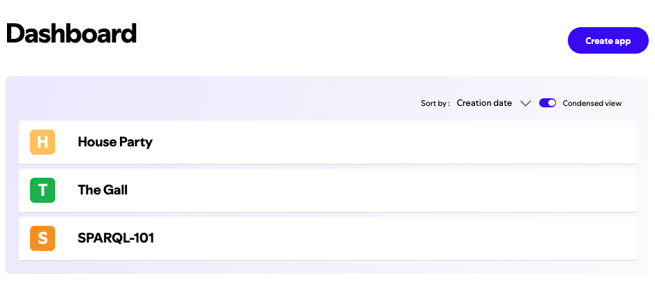
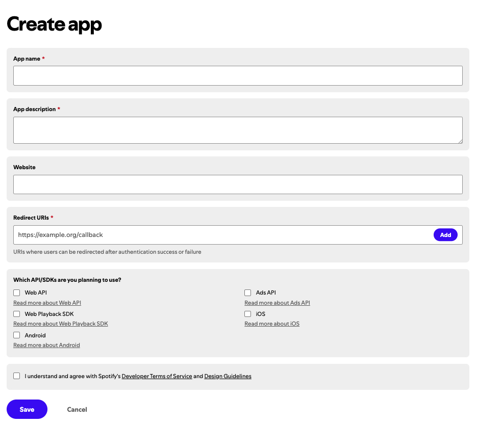

# Spotify SPARQL Queries

There is nothing better than a carefully curated playlist to help you stay focused when coding. Some of my personal favorite artists to listen to in this capacity are [A.L.I.S.O.N](https://open.spotify.com/artist/3gi5McAv9c0qTjJ5jSmbL0), [Jasper de Ceuster](https://open.spotify.com/artist/4E653XDFNhfX7sIlJWCiwb) (specifically his [Memory Bank](https://open.spotify.com/album/0D9t03mcMVQpnToulPQFd7) album), and [Lofi Girl](https://open.spotify.com/user/chilledcow).

However, there is another hidden benefit to great playlists: they are perfect subjects for ETL projects!

In this repository, I cover the entire process of extracting Spotify metadata from my wedding reception playlist, transforming it into RDF triples (subject-predicate-object), and finally loading the data as an RDF file that can be queried using SPARQL. I've also included instructions for how you can repeat this process on your own with any playlist of your choosing.

## Table of Contents
1. [Why SPARQL?](#why-sparql)
2. [RDF Data Structure](#rdf-data-structure)
3. [SPARQL Queries Used](#sparql-queries-used)
4. [Running the Queries](#running-the-queries)
5. [Setup Instructions](#setup-instructions)

## Why SPARQL?

SPARQL is a powerful language specifically designed for querying RDF data. RDF is a graph-based data format which stores information as a collection of triples. These triples represent the relationships between different pieces of data. Each triple consists of the following:
- **Subject**: The resource being described (e.g., a track).
- **Predicate**: The property or characteristic of the resource (e.g., the track's duration or its artist).
- **Object**: The value of the property (e.g., "4:02" or "The Killers").

With SPARQL, you can filter, sort, group, and manipulate RDF data to obtain meaningful insights.

## RDF Data Structure

The RDF data in this project is structured using the `schema1` namespace, which references the `schema.org` vocabulary. Here’s an example of how a track might be represented in RDF:

```ttl
@prefix schema1: <http://schema.org/> .

<spotify:track:07QlP7twNI81IsqhKLFiER> a schema1:MusicRecording ;
    schema1:byArtist <spotify:artist:4vGrte8FDu062Ntj0RsPiZ> ;
    schema1:duration "4:02" ;
    schema1:inAlbum <spotify:album:3cN3mENkACWuRCDOuQUtfw> ;
    schema1:name "Reverie" .
```

This RDF triple shows:
- A track identified by `<spotify:track:07QlP7twNI81IsqhKLFiER>`.
- It is a music recording (`schema1:MusicRecording`).
- It is associated with an artist (`schema1:byArtist`), has a duration (`schema1:duration`), belongs to an album (`schema1:inAlbum`), and has a name (`schema1:name`).

## SPARQL Queries Used

Here are some examples of the SPARQL queries used in this project, along with explanations of why they are SPARQL queries:

1. **Get the Total Number of Songs**:

    Here is the full function in Python:

    ```python
    def get_total_songs():
        query = """
        SELECT (COUNT(?track) AS ?totalSongs)
        WHERE {
            ?track a schema1:MusicRecording.
        }
        """
        results = g.query(query)
        for row in results:
            print(f"Total Number of Songs: {row.totalSongs}")
    ```

    Here is the specific query logic:

    ```sparql
    SELECT (COUNT(?track) AS ?totalSongs)
    WHERE {
        ?track a schema1:MusicRecording.
    }
    ```

    This query counts all tracks that are classified as `schema1:MusicRecording`. The `SELECT` clause retrieves the total count of tracks that match the specified pattern, while the `WHERE` clause identifies each track as a `schema1:MusicRecording`.

2. **Get the Total Playlist Duration**:

    Here is the full function in Python:

    ```python
    def get_total_duration():
        query = """
        SELECT ?duration
        WHERE {
            ?track a schema1:MusicRecording;
                schema1:duration ?duration.
        }
        """
        total_duration_seconds = 0
        results = g.query(query)
        for row in results:
            minutes, seconds = map(int, row.duration.split(":"))
            total_duration_seconds += minutes * 60 + seconds

        total_minutes = total_duration_seconds // 60
        total_seconds = total_duration_seconds % 60
        print(f"Total Playlist Duration: {total_minutes} minutes, {total_seconds} seconds")
    ```

    Here is the specific query logic:

    ```sparql
    SELECT ?duration
    WHERE {
        ?track a schema1:MusicRecording;
            schema1:duration ?duration.
    }
    ```

    This query retrieves the `duration` of all tracks. The `WHERE` clause matches triples where the subject is a music recording with a `schema1:duration` predicate, allowing the calculation of the total playlist duration.

3. **Get Songs Grouped by Artist**:

    Here is the full function in Python:

    ```python
    def get_songs_grouped_by_artist():
        query = """
        SELECT ?artistName ?songTitle
        WHERE {
            ?track a schema1:MusicRecording;
                schema1:name ?songTitle;
                schema1:byArtist ?artist.
            ?artist schema1:name ?artistName.
        }
        ORDER BY ?artistName
        """
        results = g.query(query)

        # Grouping songs by artist
        artist_songs = defaultdict(list)
        for row in results:
            artist_songs[row.artistName].append(row.songTitle)

        # Outputting results
        for artist, songs in artist_songs.items():
            print(f"{artist}:")
            for song in songs:
                print(f" - {song}")
            print()  # Blank line for readability
    ```

    Here is the specific query logic:

    ```sparql
    SELECT ?artistName ?songTitle
    WHERE {
        ?track a schema1:MusicRecording;
            schema1:name ?songTitle;
            schema1:byArtist ?artist.
        ?artist schema1:name ?artistName.
    }
    ORDER BY ?artistName
    ```

    This query retrieves songs and groups them by artist. The `SELECT` clause pulls both the artist name and song title, while the `WHERE` clause specifies the relationships needed to match the artist and song data. The `ORDER BY` clause sorts the results by artist name, making it easy to see all songs associated with each artist in alphabetical order.

## Running the Queries

### Example 1: Get the Total Number of Songs
```bash
python3 sparql.py --query total_songs
```

**Output**:
```
Total Number of Songs: 55
```

### Example 2: Get the Total Playlist Duration
```bash
python3 sparql.py --query duration
```

**Output**:
```
Total Playlist Duration: 207 minutes, 29 seconds
```

### Example 3: Get Songs Grouped by Artist
```bash
python3 sparql.py --query artist
```

**Output**:
```
 Daft Punk:
 - Instant Crush
 - Lose Yourself to Dance

Pharrell Williams:
 - Get Lucky
 - Happy

 The Killers:
 - Shot At The Night
 - Somebody Told Me
 - Read My Mind
```

## Setup Instructions

1. **Install Dependencies**:

   Make sure you have the following dependencies installed:

   ```bash
   pip3 install rdflib spotipy python-dotenv
   ```

2. **Setting up Environment Variables**:

    After you've installed the necessary dependencies, you'll need to set up your environment variables. Create a new file named `.env` in the root of your project and add the following four variables. Don't forget to include them in your `.gitignore`!

    ```env
    SPOTIFY_CLIENT_ID=
    SPOTIFY_CLIENT_SECRET=
    SPOTIFY_REDIRECT_URI=
    SPOTIFY_PLAYLIST_ID=
    ```

    The `SPOTIFY_CLIENT_ID` and `SPOTIFY_CLIENT_SECRET` can be accessed by visiting the [Spotify Developer Dashboard](https://developer.spotify.com/dashboard/).

    

    From here, click on the `Create app` button in the top right corner. Unsurprisingly, this will take you to the **Create app** page.

    

    Once you are on the **Create app** page, you will need to provide the following information:

    * App name
    * App description
    * Redirect URI

    For the redirect URI, you can add one of the following options:

    **Local Testing**:
    ```
    http://127.0.0.1:8888/spotify/callback
    ```

    **Production**:
    ```
    https://yourdomain.com/callback
    ```

    Before clicking the `Save` button, be sure to indicate that you intend to use the `Web API` below the Redirect URIs field. Once you have saved your information, you will land on your app's **Home** page. From here, click on the `Settings` button in the top right corner. This will take you to the **Basic Information** page where you will find your `SPOTIFY_CLIENT_ID` and `SPOTIFY_CLIENT_SECRET`.

    The last piece of data you will need is the `SPOTIFY_PLAYLIST_ID`. This environment variable is actually the URI for the playlist you want to analyze. To obtain this information, navigate to said playlist on Spotify and copy the URL. It should look something like this:

    ```
    https://open.spotify.com/playlist/1234asdf1234ASDF1234asd
    ```

    The character string at the end of this URL address is your `SPOTIFY_PLAYLIST_ID`. In the case of the example above, it would be this:

    ```
    1234asdf1234ASDF1234asd
    ```

3. **Connecting to the Spotify API**:

    Once you have all of your environment variables set, it's time to connect to the Spotify API. To do so, create a new file in your project called `playlist_data.py` and paste in the code snippet below:

    <details>
    <summary><code>playlist_data.py</code></summary>

    ```python
    import spotipy
    from spotipy.oauth2 import SpotifyOAuth
    from dotenv import load_dotenv
    import os

    load_dotenv()

    SPOTIFY_CLIENT_ID = os.getenv('SPOTIFY_CLIENT_ID')
    SPOTIFY_CLIENT_SECRET = os.getenv('SPOTIFY_CLIENT_SECRET')
    SPOTIFY_REDIRECT_URI = os.getenv('SPOTIFY_REDIRECT_URI')
    SPOTIFY_PLAYLIST_ID = os.getenv('SPOTIFY_PLAYLIST_ID')

    sp = spotipy.Spotify(auth_manager=SpotifyOAuth(
        client_id=SPOTIFY_CLIENT_ID,
        client_secret=SPOTIFY_CLIENT_SECRET,
        redirect_uri=SPOTIFY_REDIRECT_URI,
        scope="playlist-read-private"
    ))

    playlist = sp.playlist(SPOTIFY_PLAYLIST_ID)

    print(f"Playlist Name: {playlist['name']}")
    print(f"Total Tracks: {playlist['tracks']['total']}")

    def convert_duration(duration_ms):
        minutes = duration_ms // 60000
        seconds = (duration_ms % 60000) // 1000
        return f"{minutes}:{seconds:02d}"

    for track in playlist['tracks']['items']:
        track_info = track['track']
        track_duration = convert_duration(track_info['duration_ms'])
        print(f"Track Name: {track_info['name']}")
        print(f"Artist: {track_info['artists'][0]['name']}")
        print(f"Album: {track_info['album']['name']}")
        print(f"Duration: {track_duration}")
        print('---')
    ```

    </details>

    After you've created this file, open a new terminal and run the following command:
    ```bash
    python3 playlist_data.py
    ```

    If you successfully connected to the Spotify API, you should see something similar to the following output in your terminal:
    ```bash
    Playlist Name: Your Playlist
    Total Tracks: 20
    Track Name: Track 1
    Artist: Artist 1
    Album: Album 1
    Duration: 3:00
    ---
    Track Name: Track 2
    Artist: Artist 2
    Album: Album 2
    Duration: 4:00
    ---
    ```

    Now that you have established your connection to the Spotify API, it's time to transform the metadata into an RDF file.

4. **RDF Conversion**:

    To convert the Spotify playlist data into an RDF file, you'll need to create a new file in your project called `rdf_schema.py`. Within that file, paste in the code snippet below:

    <details>
    <summary><code>rdf_schema.py</code></summary>

    ```python
    import spotipy
    from spotipy.oauth2 import SpotifyOAuth
    from dotenv import load_dotenv
    import os
    from rdflib import Graph, URIRef, Literal, Namespace
    from rdflib.namespace import RDF, RDFS

    load_dotenv()

    SPOTIFY_CLIENT_ID = os.getenv('SPOTIFY_CLIENT_ID')
    SPOTIFY_CLIENT_SECRET = os.getenv('SPOTIFY_CLIENT_SECRET')
    SPOTIFY_REDIRECT_URI = os.getenv('SPOTIFY_REDIRECT_URI')
    SPOTIFY_PLAYLIST_ID = os.getenv('SPOTIFY_PLAYLIST_ID')

    sp = spotipy.Spotify(auth_manager=SpotifyOAuth(
        client_id=SPOTIFY_CLIENT_ID,
        client_secret=SPOTIFY_CLIENT_SECRET,
        redirect_uri=SPOTIFY_REDIRECT_URI,
        scope="playlist-read-private"
    ))

    def convert_duration(duration_ms):
        minutes = duration_ms // 60000
        seconds = (duration_ms % 60000) // 1000
        return f"{minutes}:{seconds:02d}"

    g = Graph()

    SPOTIFY = Namespace("http://www.spotify.com/ontologies/")
    SCHEMA = Namespace("http://schema.org/")

    g.bind("spotify", SPOTIFY)
    g.bind("schema", SCHEMA)

    playlist = sp.playlist(SPOTIFY_PLAYLIST_ID)

    for track in playlist['tracks']['items']:
        track_info = track['track']
        track_uri = URIRef(track_info['uri'])
    
        g.add((track_uri, RDF.type, SCHEMA.MusicRecording))
        g.add((track_uri, SCHEMA.name, Literal(track_info['name'])))
        g.add((track_uri, SCHEMA.duration, Literal(convert_duration(track_info['duration_ms']))))
    
        artist_uri = URIRef(track_info['artists'][0]['uri'])
        g.add((track_uri, SCHEMA.byArtist, artist_uri))
        g.add((artist_uri, SCHEMA.name, Literal(track_info['artists'][0]['name'])))
    
        album_uri = URIRef(track_info['album']['uri'])
        g.add((track_uri, SCHEMA.inAlbum, album_uri))
        g.add((album_uri, SCHEMA.name, Literal(track_info['album']['name'])))
    
    g.serialize(destination="your_playlist.rdf", format="turtle")

    print("RDF data generated and saved to your_playlist.rdf")
    ```

    </details>

    If you successfully ran the `rdf_schema.py` script, you should see a new `your_playlist.rdf` file appear in your directory.

5. **Analyzing your playlist data with SPARQL**:

    We are finally ready to start running SPARQL queries! First, create one last file in your project called `sparql.py`. You can copy and paste in the same code that I have in my `sparql.py` file, but I encourage you to come up with your own queries as well!

    <details>
    <summary><code>sparql.py</code></summary>

    ```python
    import argparse
    from rdflib import Graph
    from collections import defaultdict

    g = Graph()
    g.parse("your_playlist.rdf", format="turtle")

    # Helper Functions

    def convert_duration(duration_str):
        minutes, seconds = map(int, duration_str.split(":"))
        return f"{minutes} minutes, {seconds} seconds"

    def get_all_artists():
        query = """
        SELECT DISTINCT ?artistName
        WHERE {
            ?track a schema1:MusicRecording;
                schema1:byArtist ?artist.
            ?artist schema1:name ?artistName.
        }
        ORDER BY ASC(?artistName)
        """
        results = g.query(query)
        return [str(row.artistName) for row in results]

    # 1.) Get the total playlist duration
    # CLI Command: python3 sparql.py --query duration

    def get_total_duration():
        query = """
        SELECT ?duration
        WHERE {
            ?track a schema1:MusicRecording;
                schema1:duration ?duration.
        }
        """
        total_duration_seconds = 0
        results = g.query(query)
        for row in results:
            minutes, seconds = map(int, row.duration.split(":"))
            total_duration_seconds += minutes * 60 + seconds

        total_minutes = total_duration_seconds // 60
        total_seconds = total_duration_seconds % 60
        print(f"Total Playlist Duration: {total_minutes} minutes, {total_seconds} seconds")

    # 2.) Get the total number of songs in the playlist
    # CLI Command: python3 sparql.py --query total_songs

    def get_total_songs():
        query = """
        SELECT (COUNT(?track) AS ?totalSongs)
        WHERE {
            ?track a schema1:MusicRecording.
        }
        """
        results = g.query(query)
        for row in results:
            print(f"Total Number of Songs: {row.totalSongs}")

    # 3.) Get songs sorted by length in descending order
    # CLI Command: python3 sparql.py --query length

    def get_songs_sorted_by_length():
        query = """
        SELECT ?songTitle ?duration
        WHERE {
            ?track a schema1:MusicRecording;
                schema1:name ?songTitle;
                schema1:duration ?duration.
        }
        ORDER BY DESC(?duration)
        """
        results = g.query(query)
        for index, row in enumerate(results, start=1):
            print(f"{index}. {row.songTitle}: {row.duration}")

    # 4.) Get the longest song in the playlist
    # CLI Command: python3 sparql.py --query longest

    def get_longest_song():
        query = """
        SELECT ?songTitle ?duration
        WHERE {
            ?track a schema1:MusicRecording;
                schema1:name ?songTitle;
                schema1:duration ?duration.
        }
        ORDER BY DESC(?duration)
        LIMIT 1
        """
        results = g.query(query)
        for row in results:
            print(f"Longest Song: {row.songTitle}, Duration: {row.duration}")

    # 5.) Get the shortest song in the playlist
    # CLI Command: python3 sparql.py --query shortest

    def get_shortest_song():
        query = """
        SELECT ?songTitle ?duration
        WHERE {
            ?track a schema1:MusicRecording;
                schema1:name ?songTitle;
                schema1:duration ?duration.
        }
        ORDER BY ASC(?duration)
        LIMIT 1
        """
        results = g.query(query)
        for row in results:
            print(f"Shortest Song: {row.songTitle}, Duration: {row.duration}")

    # 6.) Get songs longer than a specific duration
    # CLI Command: python3 sparql.py --query longer_than --min_duration "4:00"

    def get_songs_longer_than(duration):
        query = f"""
        SELECT ?songTitle ?duration
        WHERE {{
            ?track a schema1:MusicRecording;
                schema1:name ?songTitle;
                schema1:duration ?duration.
            FILTER (?duration > "{duration}")
        }}
        ORDER BY DESC(?duration)
        """
        results = g.query(query)
        for index, row in enumerate(results, start=1):
            print(f"{index}. {row.songTitle}: {row.duration}")

    # 7.) Get songs grouped by album
    # CLI Command: python3 sparql.py --query album

    def get_songs_grouped_by_album():
        query = """
        SELECT ?albumTitle ?songTitle
        WHERE {
            ?track a schema1:MusicRecording;
                schema1:name ?songTitle;
                schema1:inAlbum ?album.
            ?album schema1:name ?albumTitle.
        }
        ORDER BY ?albumTitle
        """
        results = g.query(query)

        album_songs = defaultdict(list)

        for row in results:
            album_songs[row.albumTitle].append(row.songTitle)

        for album, songs in album_songs.items():
            print(f"{album}:")
            for song in songs:
                print(f" - {song}")
            print()

    # 8.) Get songs grouped by artist
    # CLI Command: python3 sparql.py --query artist

    def get_songs_grouped_by_artist():
        query = """
        SELECT ?artistName ?songTitle
        WHERE {
            ?track a schema1:MusicRecording;
                schema1:name ?songTitle;
                schema1:byArtist ?artist.
            ?artist schema1:name ?artistName.
        }
        ORDER BY ?artistName
        """
        results = g.query(query)

        artist_songs = defaultdict(list)

        for row in results:
            artist_songs[row.artistName].append(row.songTitle)

        for artist, songs in artist_songs.items():
            print(f"{artist}:")
            for song in songs:
                print(f" - {song}")
            print()

    # 9.) Get artists sorted by most appearances in descending order
    # CLI Command: python3 sparql.py --query by_appearance

    def get_artists_by_appearance():
        query = """
        SELECT ?artistName (COUNT(?track) AS ?numSongs)
        WHERE {
            ?track a schema1:MusicRecording;
                schema1:byArtist ?artist.
            ?artist schema1:name ?artistName.
        }
        GROUP BY ?artistName
        ORDER BY DESC(?numSongs)
        """
        results = g.query(query)
        for index, row in enumerate(results, start=1):
            print(f"{index}. {row.artistName}: {row.numSongs} songs")

    # 10.) Get all songs by a specific artist (manual input)
    # CLI Command: python3 sparql.py --query by_artist

    def get_songs_by_artist():
        artists = get_all_artists()
        print("Artists:")
        for i, artist in enumerate(artists, 1):
            print(f"{i}. {artist}")

        selected_artist = input("Enter the artist's name from the list above: ")

        query = f"""
        SELECT ?songTitle
        WHERE {{
            ?track a schema1:MusicRecording;
                schema1:name ?songTitle;
                schema1:byArtist ?artist.
            ?artist schema1:name "{selected_artist}".
        }}
        """
        results = g.query(query)
        print(f"Songs by {selected_artist}:")
        for row in results:
            print(f" - {row.songTitle}")

    if __name__ == "__main__":
        parser = argparse.ArgumentParser(description="Run SPARQL queries on your RDF playlist data.")
    
        parser.add_argument(
            "--query", 
            type=str, 
            required=True, 
            choices=["duration", "total_songs", "length", "longest", "shortest", "longer_than", "album", "artist", "by_appearance", "by_artist"], 
            help="Specify the query to run."
        )
    
        parser.add_argument(
            "--min_duration", 
            type=str, 
            help="Minimum duration in 'mm:ss' (required if 'longer_than' query is selected)"
        )

        args = parser.parse_args()

        if args.query == "duration":
            get_total_duration()
        elif args.query == "total_songs":
            get_total_songs()
        elif args.query == "length":
            get_songs_sorted_by_length()
        elif args.query == "longest":
            get_longest_song()
        elif args.query == "shortest":
            get_shortest_song()
        elif args.query == "longer_than":
            if args.min_duration:
                get_songs_longer_than(args.min_duration)
            else:
                print("Error: --min_duration is required for the 'longer_than' query.")
        elif args.query == "album":
            get_songs_grouped_by_album()
        elif args.query == "artist":
            get_songs_grouped_by_artist()
        elif args.query == "by_appearance":
            get_artists_by_appearance()
        elif args.query == "by_artist":
            get_songs_by_artist()
    ```

    </details>