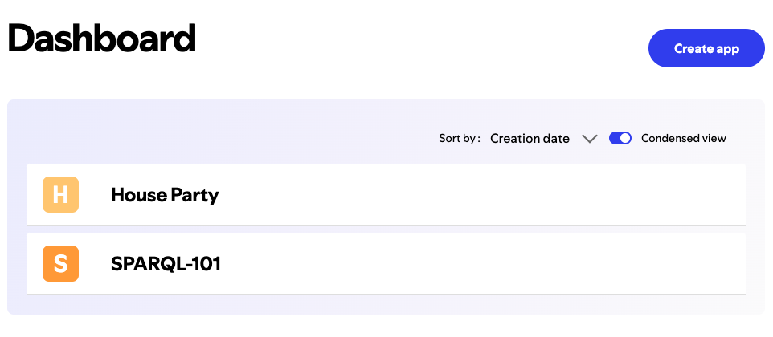

# Spotify SPARQL Queries

There is nothing better than a carefully curated playlist to help you stay focused when coding. Some of my personal favorite artists to listen to in this capacity are [A.L.I.S.O.N](https://open.spotify.com/artist/3gi5McAv9c0qTjJ5jSmbL0), [Jasper de Ceuster](https://open.spotify.com/artist/4E653XDFNhfX7sIlJWCiwb) (specifically his [Memory Bank](https://open.spotify.com/album/0D9t03mcMVQpnToulPQFd7) album), and [Lofi Girl](https://open.spotify.com/user/chilledcow).

However, there is another hidden benefit to great playlists: they are perfect subjects for ETL projects!

In this repository, I cover the entire process of extracting Spotify metadata from my wedding reception playlist, transforming it into RDF triples (subject-predicate-object), and finally loading the data as an RDF file that can be queried using SPARQL. I've also included istructions for how you can repeat this process on your own with any playlist of your choosing.

## Table of Contents
1. [Why SPARQL?](#why-sparql)
2. [RDF Data Structure](#rdf-data-structure)
3. [SPARQL Queries Used](#sparql-queries-used)
4. [Running the Queries](#running-the-queries)
5. [Setup Instructions](#setup-instructions)

## Why SPARQL?

SPARQL is a powerful language specifically designed for querying RDF data. RDF is a graph-based data format which stores information as a collection of triples. These triples represent the relationships between different pieces of data. Each triple consists of the following:
- **Subject**: The resource being described (e.g., a track).
- **Predicate**: The property or characteristic of the resource (e.g., the track's duration or its artist).
- **Object**: The value of the property (e.g., "4:02" or "The Killers").

SPARQL queries are well-suited for querying this kind of data because they match patterns of triples in the RDF graph. With SPARQL, you can filter, sort, group, and manipulate RDF data to obtain meaningful insights.

## RDF Data Structure

The RDF data in this project is structured using the `schema1` namespace, which references the `schema.org` vocabulary. Here’s an example of how a track might be represented in RDF:

```ttl
@prefix schema1: <http://schema.org/> .

<spotify:track:07QlP7twNI81IsqhKLFiER> a schema1:MusicRecording ;
    schema1:byArtist <spotify:artist:4vGrte8FDu062Ntj0RsPiZ> ;
    schema1:duration "4:02" ;
    schema1:inAlbum <spotify:album:3cN3mENkACWuRCDOuQUtfw> ;
    schema1:name "Reverie" .
```

This RDF triple shows:
- A track identified by `<spotify:track:07QlP7twNI81IsqhKLFiER>`.
- It is a music recording (`a schema1:MusicRecording`).
- It is associated with an artist (`schema1:byArtist`), has a duration (`schema1:duration`), belongs to an album (`schema1:inAlbum`), and has a name (`schema1:name`).

## SPARQL Queries Used

Here are some examples of the SPARQL queries used in this project, along with explanations of why they are SPARQL queries:

1. **Get the Total Number of Songs**:

    Here is the full function in Python:

    ```python
    def get_total_songs():
        query = """
        SELECT (COUNT(?track) AS ?totalSongs)
        WHERE {
            ?track a schema1:MusicRecording.
        }
        """
        results = g.query(query)
        for row in results:
            print(f"Total Number of Songs: {row.totalSongs}")
    ```

    Here is the specific query logic:

    ```sparql
    SELECT (COUNT(?track) AS ?totalSongs)
    WHERE {
        ?track a schema1:MusicRecording.
    }
    ```

    This query counts all tracks that are classified as `schema1:MusicRecording`. The `SELECT` clause retrieves the total count of tracks that match the specified pattern, while the `WHERE` clause identifies each track as a `schema1:MusicRecording`.

2. **Get the Total Playlist Duration**:

    Here is the full function in Python:

    ```python
    def get_total_duration():
        query = """
        SELECT ?duration
        WHERE {
            ?track a schema1:MusicRecording;
                schema1:duration ?duration.
        }
        """
        total_duration_seconds = 0
        results = g.query(query)
        for row in results:
            minutes, seconds = map(int, row.duration.split(":"))
            total_duration_seconds += minutes * 60 + seconds

        total_minutes = total_duration_seconds // 60
        total_seconds = total_duration_seconds % 60
        print(f"Total Playlist Duration: {total_minutes} minutes, {total_seconds} seconds")
    ```

    Here is the specific query logic:

    ```sparql
    SELECT ?duration
    WHERE {
        ?track a schema1:MusicRecording;
            schema1:duration ?duration.
    }
    ```

    This query retrieves the `duration` of all tracks. The `WHERE` clause matches triples where the subject is a music recording with a `schema1:duration` predicate, allowing the calculation of the total playlist duration.

3. **Get Songs Grouped by Artist**:

    Here is the full function in Python:

    ```python
    def get_songs_grouped_by_artist():
        query = """
        SELECT ?artistName ?songTitle
        WHERE {
            ?track a schema1:MusicRecording;
                schema1:name ?songTitle;
                schema1:byArtist ?artist.
            ?artist schema1:name ?artistName.
        }
        ORDER BY ?artistName
        """
        results = g.query(query)

        # Grouping songs by artist
        artist_songs = defaultdict(list)
        for row in results:
            artist_songs[row.artistName].append(row.songTitle)

        # Outputting results
        for artist, songs in artist_songs.items():
            print(f"{artist}:")
            for song in songs:
                print(f" - {song}")
            print()  # Blank line for readability
    ```

    Here is the specific query logic:

    ```sparql
    SELECT ?artistName ?songTitle
    WHERE {
        ?track a schema1:MusicRecording;
            schema1:name ?songTitle;
            schema1:byArtist ?artist.
        ?artist schema1:name ?artistName.
    }
    ORDER BY ?artistName
    ```

    This query retrieves songs and groups them by artist. The `SELECT` clause pulls both the artist name and song title, while the `WHERE` clause specifies the relationships needed to match the artist and song data. The `ORDER BY` clause sorts the results by artist name, making it easy to see all songs associated with each artist in alphabetical order.

## Running the Queries

### Example 1: Get the Total Number of Songs
```bash
python3 sparql.py --query total_songs
```

**Output**:
```
Total Number of Songs: 55
```

### Example 2: Get the Total Playlist Duration
```bash
python3 sparql.py --query duration
```

**Output**:
```
Total Playlist Duration: 207 minutes, 29 seconds
```

### Example 3: Get Songs Grouped by Artist
```bash
python3 sparql.py --query artist
```

**Output**:
```
 Daft Punk:
 - Instant Crush
 - Lose Yourself to Dance

Pharrell Williams:
 - Get Lucky
 - Happy

 The Killers:
 - Shot At The Night
 - Somebody Told Me
 - Read My Mind
```

## Setup Instructions

1. **Install Dependencies**:
   Make sure you have the following dependencies installed:

   ```bash
   pip3 install rdflib spotipy python-dotenv
   ```

2. **Setting up Environment Variables**:
    Once you've installed the necessary dependencies, you'll need to set up your environment variables. Create a new file named `.env` in the root of your project and add the following four variables. Don't forget to include them in your `.gitignore`!

    ```env
    SPOTIFY_CLIENT_ID=
    SPOTIFY_CLIENT_SECRET=
    SPOTIFY_REDIRECT_URI=
    SPOTIFY_PLAYLIST_ID=
    ```

    The `SPOTIFY_CLIENT_ID` and `SPOTIFY_CLIENT_SECRET` can be accessed by visiting the [Spotify Developer Dashboard](https://developer.spotify.com/dashboard/).

    

    From here, click on the `Create app` button in the top right corner. Unsurprisingly, this will take you to the **Create app** page.

    